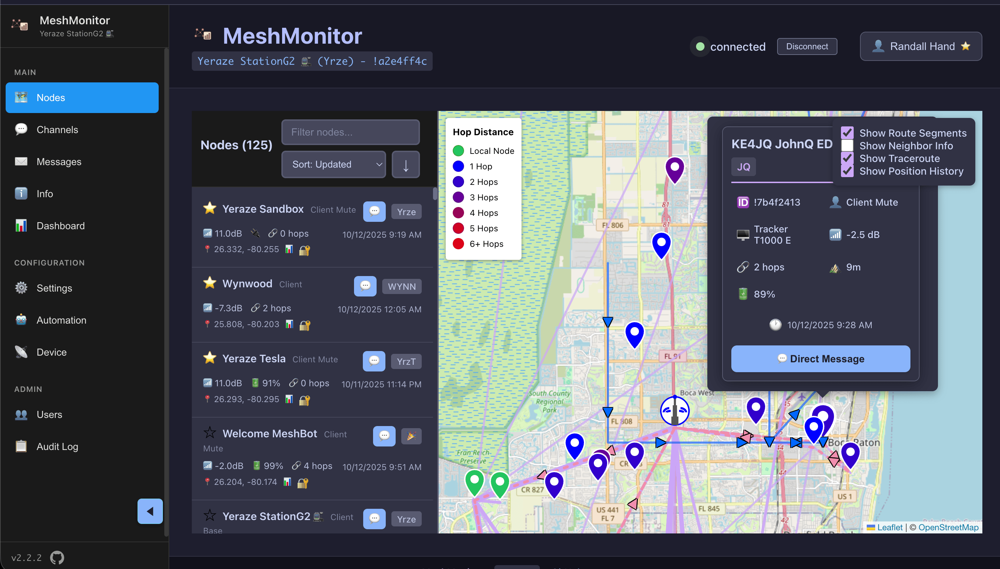
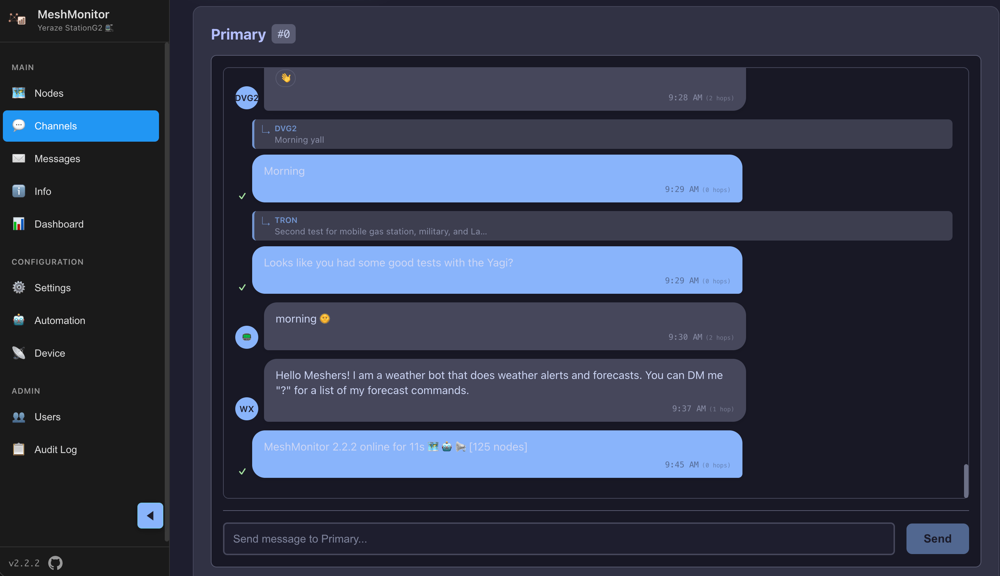

# MeshMonitor

[](https://github.com/Yeraze/meshmonitor/actions/workflows/ci.yml)
[](https://github.com/Yeraze/meshmonitor/actions/workflows/pr-tests.yml)
[](https://github.com/Yeraze/meshmonitor/pkgs/container/meshmonitor)
[](https://github.com/Yeraze/meshmonitor/pkgs/container/meshmonitor)
[](https://github.com/Yeraze/meshmonitor/blob/main/LICENSE)

A comprehensive web application for monitoring Meshtastic mesh networks over IP. Built with React, TypeScript, and Node.js, featuring a beautiful Catppuccin Mocha dark theme and persistent SQLite database storage.





## 🚀 Getting Started

Get MeshMonitor running in minutes with these simple copy-paste commands:

### Quick Start with Docker (Recommended)

Get MeshMonitor running in **60 seconds** with just 3 steps:

**1. Create docker-compose.yml**

```bash
cat > docker-compose.yml << 'EOF'
services:
  meshmonitor:
    image: ghcr.io/yeraze/meshmonitor:latest
    container_name: meshmonitor
    ports:
      - "8080:3001"
    volumes:
      - meshmonitor-data:/data
    environment:
      - MESHTASTIC_NODE_IP=192.168.1.100  # Change to your node's IP
    restart: unless-stopped

volumes:
  meshmonitor-data:
EOF
```

**2. Start MeshMonitor**

```bash
docker compose up -d
```

**3. Open your browser**

```
http://localhost:8080
```

**Default login:** Username `admin` / Password `changeme` (change this after first login!)

---

**That's it!** MeshMonitor is now running with sensible defaults optimized for local HTTP access.

For production deployments with HTTPS, reverse proxies, or advanced security, see [Production Deployment Guide](docs/configuration/production.md)

### Requirements

- **A Meshtastic node** with WiFi/Ethernet connectivity
- **TCP port 4403** accessible from your MeshMonitor host
- **Docker** (or Node.js 20+ for manual deployment)

### Common Configuration Scenarios

**1. Remote Node Connection**
```bash
# Connect to a node on your network
export MESHTASTIC_NODE_IP=192.168.5.25
docker compose up -d
```

**2. Subfolder Deployment (e.g., /meshmonitor)**
```bash
# Run at https://example.com/meshmonitor/
export BASE_URL=/meshmonitor
export MESHTASTIC_NODE_IP=192.168.1.100
docker compose up -d
```

**3. Kubernetes/Helm Deployment**
```bash
helm install meshmonitor ./helm/meshmonitor \
  --set env.meshtasticNodeIp=192.168.1.100 \
  --set env.meshtasticTcpPort=4403
```

**4. Using BLE Bridge or Serial Proxy**

**For Bluetooth Devices:**
Use the [MeshMonitor BLE Bridge](https://github.com/Yeraze/meshtastic-ble-bridge) for connecting BLE-only Meshtastic devices:

```bash
# Using docker-compose overlay
echo "BLE_ADDRESS=AA:BB:CC:DD:EE:FF" > .env
docker compose -f docker-compose.yml -f docker-compose.ble.yml up -d
```

See the [BLE Bridge repository](https://github.com/Yeraze/meshtastic-ble-bridge) for detailed setup instructions.

**For Serial/USB Devices:**
Use the [Meshtastic Serial Bridge](/configuration/serial-bridge):

```bash
# Create docker-compose.yml with serial-bridge
cat > docker-compose.yml << 'EOF'
services:
  serial-bridge:
    image: ghcr.io/yeraze/meshtastic-serial-bridge:latest
    devices:
      - /dev/ttyUSB0:/dev/ttyUSB0  # Change to your device
    ports:
      - "4403:4403"
    restart: unless-stopped

  meshmonitor:
    image: ghcr.io/yeraze/meshmonitor:latest
    environment:
      - MESHTASTIC_NODE_IP=serial-bridge
    ports:
      - "8080:3001"
    volumes:
      - meshmonitor-data:/data
    depends_on:
      - serial-bridge

volumes:
  meshmonitor-data:
EOF

docker compose up -d
```

See the [Serial Bridge configuration guide](/configuration/serial-bridge) for detailed setup instructions.

## Features

### 🌐 **Real-time Mesh Network Monitoring**
- Connect to Meshtastic nodes via direct TCP connection (port 4403)
- Real-time node discovery and status updates via event-driven architecture
- Signal strength monitoring (SNR, RSSI)
- GPS position tracking
- Battery and voltage telemetry
- Node role display (Client, Router, Repeater, etc.)
- Hops Away tracking for network distance

### 💬 **iPhone Messages-Style UI with Reactions**
- Beautiful message bubbles with proper alignment
- **Interactive reply button** - Reply to any message with proper threading
- **Instant emoji reactions** - Quick tapback with 👍 👎 ❓ ❗ 😂 😢 💩
- Hover-based action menu on each message
- Clickable existing reactions to send the same emoji
- Sender identification dots with tooltips
- Real-time message delivery status
- Send and receive text messages
- Direct messaging and channel broadcasts
- Message persistence across restarts
- Optimistic UI updates for instant feedback

### 🗄️ **Persistent Data Storage**
- SQLite database for messages, nodes, and traceroutes
- Automatic data deduplication
- Export/import functionality
- Data cleanup utilities
- Cross-restart persistence
- Traceroute history storage with SNR data

### 🎨 **Modern UI/UX**
- Catppuccin Mocha dark theme
- Responsive design for mobile/desktop
- Real-time connection status
- Interactive node cards
- Smooth animations and transitions

### 🗺️ **Network Mapping & Traceroutes**
- Interactive map with node positions
- Automatic traceroute scheduler (runs every 3 minutes)
- Weighted route visualization (thickness based on usage)
- Route display with "Show Routes" toggle
- Network topology discovery
- Traceroute history with SNR tracking

### 🔔 **Flexible Notifications**
- **Dual Notification System**: Choose Web Push (browser), Apprise (100+ services), or both
- **Web Push Notifications**: Browser-based push notifications with PWA support
- **Apprise Integration**: Send notifications to Discord, Slack, Telegram, Email, SMS, and 100+ other services
- **No HTTPS Required**: Apprise works over HTTP, removing SSL certificate barrier
- **Per-User Preferences**: Individual control over notification methods and filtering
- **Smart Filtering**: Whitelist/blacklist keywords, channel selection, and DM toggles
- **Shared Filter Logic**: Consistent filtering across both notification methods
- **Service Worker**: Background push support with custom icons and notification tags
- **Notification Sounds**: Audio alerts for new messages (configurable per-user)
- **Unread Indicators**: Visual badges showing unread message counts

### ⚙️ **Device Configuration**
- Comprehensive device configuration UI with toast notifications
- **Node Settings**: Configure long name, short name, device role, and node info broadcast interval
- **LoRa Configuration**: Set modem preset, region, and hop limit (1-7 hops)
- **Position Configuration**: Configure fixed position with GPS coordinates, position broadcast interval, and smart positioning
- **MQTT Configuration**: Set up MQTT server, credentials, encryption, JSON mode, and root topic
- **GPS Coordinates Helper**: Quick link to find your exact GPS coordinates
- Real-time device synchronization with automatic reboot handling
- Input validation and helpful error messages

### 🔐 **Authentication & Security**
- **Session-based authentication** with secure cookie management
- **Local authentication** (username/password) with bcrypt password hashing
- **OpenID Connect (OIDC)** support for enterprise identity providers
- **Role-based access control (RBAC)** with granular permissions
- **Connection control permission** - manage who can disconnect/reconnect from nodes
- **Traceroute permission** - control who can initiate traceroute requests
- **Security monitoring permission** - control access to encryption key security scans
- **Anonymous user support** for read-only public access
- **Default password warning** banner for security best practices
- **Audit logging** for all authentication and administrative actions
- **User management** interface for admins (create, deactivate, reset passwords)

### 🛡️ **Security Monitoring**
- **Encryption Key Security Analysis**: Monitor mesh network for encryption vulnerabilities
- **Low-Entropy Key Detection**: Identify nodes using weak encryption keys vulnerable to brute-force attacks
  - Entropy score calculation with severity indicators (High Risk, Medium Risk, Low Risk)
  - Hardware model identification for affected devices
  - Direct links to detailed fix documentation
- **Duplicate Key Detection**: Identify nodes sharing the same encryption key
  - Privacy violation warnings between devices
  - Grouped display showing all nodes with duplicate keys
  - Impacted node count per duplicate key
- **Comprehensive Remediation Guides**: Platform-specific instructions for fixing security issues
  - Step-by-step guides for iOS, Android, and CLI
  - Real-world attack scenarios explained
  - Best practices for encryption key management
  - FAQ addressing common security concerns

### 🔄 **System Management**
- **Manual connection control** - disconnect/reconnect from nodes with permission control
  - Cached data remains accessible while disconnected (read-only mode)
  - Connection state preserved through page refreshes
  - Header displays connected node info with IP tooltip
- **Automatic update notifications** - banner alerts when new versions are available
- **Container restart** functionality from the UI (Docker deployments)
- **Version check API** - integrates with GitHub releases
- **Database-backed settings** for automation and configuration persistence
- **System status** endpoint with uptime, memory usage, and version info

### 🐳 **Docker Support**
- Pre-built images on GitHub Container Registry
- Full containerization with Docker and Docker Compose
- Persistent data volumes
- Production-ready deployment
- Environment-based configuration
- Multi-architecture support

## Quick Start

### Prerequisites

- Node.js 20+ or 22+ (Node.js 18 is deprecated and will lose support April 2025)
- Docker (recommended) or local Node.js environment
- A Meshtastic device with WiFi/Ethernet connectivity
- Network access to your Meshtastic node

### Docker Deployment

#### Option 1: Using Pre-built Image from GitHub Container Registry (Recommended)

The easiest way to deploy MeshMonitor is using the pre-built Docker images published to GitHub Container Registry:

```bash
# Set environment variables
export MESHTASTIC_NODE_IP=192.168.1.100
export MESHTASTIC_TCP_PORT=4403

# Pull and start the application
docker-compose up -d
```

The default `docker-compose.yml` is configured to use `ghcr.io/yeraze/meshmonitor:latest`.

You can also specify a specific version:
```bash
docker pull ghcr.io/yeraze/meshmonitor:2.12.0
docker run -d \
  -p 8080:3001 \
  -v meshmonitor-data:/data \
  -e MESHTASTIC_NODE_IP=192.168.1.100 \
  -e MESHTASTIC_TCP_PORT=4403 \
  ghcr.io/yeraze/meshmonitor:2.12.0
```

#### Option 2: Build Locally

If you want to build from source:

1. **Edit docker-compose.yml** - Comment out the `image` line and uncomment the `build` section:
   ```yaml
   # image: ghcr.io/yeraze/meshmonitor:latest
   build:
     context: .
     dockerfile: Dockerfile
   ```

2. **Build and start**:
   ```bash
   docker-compose up -d --build
   ```

#### Access the Application
- Open http://localhost:8080 in your browser
- The application will automatically attempt to connect to your Meshtastic node

#### Available Image Tags
- `latest` - Latest build from main branch
- `1.0.0`, `1.0`, `1` - Specific version tags
- `main` - Development builds from main branch

### Kubernetes Deployment

MeshMonitor includes a Helm chart for easy deployment to Kubernetes clusters. The chart supports all Docker environment variables, persistent storage, ingress, and subfolder deployments.

**Quick Install:**
```bash
helm install meshmonitor ./helm/meshmonitor \
  --set env.meshtasticNodeIp=192.168.1.100 \
  --set env.meshtasticTcpPort=4403
```

For complete Kubernetes documentation, configuration options, and examples, see the [Helm Chart README](helm/README.md).

### Development Setup

1. **Clone the repository with submodules**
   ```bash
   git clone --recurse-submodules https://github.com/Yeraze/meshmonitor.git
   cd meshmonitor
   ```

   **Important:** If you already cloned without `--recurse-submodules`:
   ```bash
   git submodule update --init --recursive
   ```

2. **Install dependencies**
   ```bash
   npm install
   ```

3. **Configure environment**
   ```bash
   cp .env.example .env
   # Edit .env with your Meshtastic node's IP address
   ```

4. **Start development servers**
   ```bash
   npm run dev:full
   ```

   This starts both the React dev server (port 5173) and the Express API server (port 3001).

## Configuration

### Environment Variables

| Variable | Default | Description |
|----------|---------|-------------|
| `MESHTASTIC_NODE_IP` | `192.168.1.100` | IP address of your Meshtastic node |
| `MESHTASTIC_TCP_PORT` | `4403` | TCP port for Meshtastic node connection |
| `NODE_ENV` | `development` | Environment mode |
| `PORT` | `3001` | Server port (production) |
| `BASE_URL` | (empty) | Runtime base URL path for subfolder deployment (e.g., `/meshmonitor`) |
| `TZ` | `America/New_York` | Timezone for auto-acknowledge message timestamps (see [TZ database](https://en.wikipedia.org/wiki/List_of_tz_database_time_zones)) |
| `SESSION_SECRET` | (auto-generated) | Secret key for session encryption. **Required for production deployments** |
| `SESSION_MAX_AGE` | `86400000` | Session cookie lifetime in milliseconds (default: 24 hours) |
| `SESSION_ROLLING` | `true` | Reset session expiry on each request. When true, active users stay logged in indefinitely |
| `COOKIE_SECURE` | `true` (production)<br>`false` (development) | Require HTTPS for session cookies. Set to `false` if accessing over HTTP in production (not recommended) |
| `COOKIE_SAMESITE` | `strict` (production)<br>`lax` (development) | SameSite cookie policy (`strict`, `lax`, or `none`) |
| `TRUST_PROXY` | `1` (production)<br>unset (development) | Trust reverse proxy headers (`true`, `false`, number of hops, or IP/CIDR). Required for HTTPS reverse proxy setups |
| `PUSH_NOTIFICATION_TTL` | `3600` | Push notification Time To Live in seconds (300-86400). Prevents notification flooding when devices come back online |
| `ENABLE_VIRTUAL_NODE` | `false` | Enable virtual node server for multiple mobile app connections. Acts as TCP proxy to physical node |
| `VIRTUAL_NODE_PORT` | `4404` | TCP port for virtual node server. Mobile apps connect to this port instead of directly to physical node |

### Meshtastic Node Requirements

Your Meshtastic device must have:
- WiFi or Ethernet connectivity
- TCP port 4403 accessible (standard Meshtastic port)
- Network accessibility from MeshMonitor

## Authentication & Authorization

**MeshMonitor v2.0+** includes a comprehensive authentication and authorization system with:

- **Local Authentication**: Username/password with secure bcrypt hashing
- **OpenID Connect (OIDC)**: Integration with enterprise identity providers
- **Granular Permissions**: Resource-based access control (dashboard, nodes, channels, messages, settings, connection control, traceroute initiation, etc.)
- **User Management**: Admin interface for creating and managing users
- **Session Security**: Secure session storage with SQLite backend

### Quick Start

On first startup, MeshMonitor creates a default admin account:
- **Username**: `admin`
- **Password**: `changeme`

**⚠️ Change the default password immediately after first login!**

### OIDC Integration

MeshMonitor supports Single Sign-On (SSO) with any OpenID Connect provider:

- **Authentik** - Open-source Identity Provider
- **Keycloak** - Red Hat's open-source IAM
- **Auth0**, **Okta**, **Azure AD**, **Google Workspace**
- Any OIDC-compliant provider

**Enable OIDC:**
```yaml
environment:
  - OIDC_ENABLED=true
  - OIDC_ISSUER=https://auth.example.com/application/o/meshmonitor/
  - OIDC_CLIENT_ID=your-client-id
  - OIDC_CLIENT_SECRET=your-client-secret
  - OIDC_REDIRECT_URI=https://meshmonitor.example.com/api/auth/oidc/callback
```

### Full Documentation

For complete authentication setup, OIDC configuration with step-by-step provider examples, permission management, and security best practices, see:

**📖 [Authentication & Authorization Guide](docs/AUTHENTICATION.md)**

## Reverse Proxy Configuration

MeshMonitor supports being served from a subfolder using the `BASE_URL` environment variable. This allows you to host MeshMonitor at a path like `https://example.com/meshmonitor/` instead of the root.

**Important:** BASE_URL is now a **runtime-only** configuration. You can use the same Docker image for any base path - just set the BASE_URL environment variable when running the container.

### HTTPS Reverse Proxy Setup

When deploying MeshMonitor behind a reverse proxy with HTTPS (recommended), you need to configure MeshMonitor to trust the proxy headers. This is **critical for proper session cookie handling**.

**Why this matters:** When a reverse proxy terminates HTTPS, MeshMonitor sees the connection as HTTP. Without trusting proxy headers, secure cookies won't work correctly, causing login failures.

**Solution:** Set `TRUST_PROXY=true` (or `TRUST_PROXY=1` for single proxy):

```yaml
environment:
  - NODE_ENV=production
  - TRUST_PROXY=true  # Required for HTTPS reverse proxy
  - SESSION_SECRET=your-secret-here
```

**Advanced trust proxy configurations:**
- `TRUST_PROXY=true` - Trust all proxies (use with caution)
- `TRUST_PROXY=1` - Trust first proxy only (recommended, default in production)
- `TRUST_PROXY=2` - Trust first 2 proxies (for CDN + reverse proxy)
- `TRUST_PROXY=false` - Don't trust any proxies
- `TRUST_PROXY=192.168.1.0/24` - Trust specific subnet

### Reverse Proxy Examples

#### nginx (Root Path)

```nginx
server {
    listen 443 ssl;
    server_name meshmonitor.example.com;

    ssl_certificate /path/to/cert.pem;
    ssl_certificate_key /path/to/key.pem;

    location / {
        proxy_pass http://localhost:8080;
        proxy_set_header Host $host;
        proxy_set_header X-Real-IP $remote_addr;
        proxy_set_header X-Forwarded-For $proxy_add_x_forwarded_for;
        proxy_set_header X-Forwarded-Proto $scheme;  # Required for TRUST_PROXY
    }
}
```

**MeshMonitor Configuration:**
```yaml
environment:
  - NODE_ENV=production
  - TRUST_PROXY=true
  - SESSION_SECRET=your-secret-here
```

#### nginx (Subfolder)

```nginx
location ^~ /meshmonitor {
    # Strip the /meshmonitor prefix when proxying
    rewrite /meshmonitor(.*) /$1 break;

    proxy_pass http://localhost:8080;
    proxy_set_header Host $host;
    proxy_set_header X-Real-IP $remote_addr;
    proxy_set_header X-Forwarded-For $proxy_add_x_forwarded_for;
    proxy_set_header X-Forwarded-Proto $scheme;  # Required for TRUST_PROXY
}
```

**MeshMonitor Configuration:**
```yaml
environment:
  - NODE_ENV=production
  - BASE_URL=/meshmonitor
  - TRUST_PROXY=true
  - SESSION_SECRET=your-secret-here
```

#### Traefik (Docker Labels)

```yaml
services:
  meshmonitor:
    image: ghcr.io/yeraze/meshmonitor:latest
    labels:
      - "traefik.enable=true"
      - "traefik.http.routers.meshmonitor.rule=Host(`meshmonitor.example.com`)"
      - "traefik.http.routers.meshmonitor.entrypoints=websecure"
      - "traefik.http.routers.meshmonitor.tls.certresolver=letsencrypt"
      - "traefik.http.services.meshmonitor.loadbalancer.server.port=3001"
    environment:
      - NODE_ENV=production
      - TRUST_PROXY=true  # Traefik automatically sets X-Forwarded-* headers
      - SESSION_SECRET=your-secret-here
      - MESHTASTIC_NODE_IP=192.168.1.100
```

#### Caddy

```
meshmonitor.example.com {
    reverse_proxy localhost:8080
}
```

**MeshMonitor Configuration:**
```yaml
environment:
  - NODE_ENV=production
  - TRUST_PROXY=true  # Caddy automatically sets X-Forwarded-* headers
  - SESSION_SECRET=your-secret-here
```

### Docker Configuration

Simply set the `BASE_URL` environment variable at runtime:

```yaml
services:
  meshmonitor:
    image: ghcr.io/yeraze/meshmonitor:latest
    environment:
      - BASE_URL=/meshmonitor  # Set at runtime, no rebuild needed!
      - MESHTASTIC_NODE_IP=192.168.1.100
      - MESHTASTIC_TCP_PORT=4403
    # ... rest of configuration
```

Or with docker run:

```bash
docker run -d \
  -p 8080:3001 \
  -e BASE_URL=/meshmonitor \
  -e MESHTASTIC_NODE_IP=192.168.1.100 \
  -e MESHTASTIC_TCP_PORT=4403 \
  ghcr.io/yeraze/meshmonitor:latest
```

The HTML is dynamically rewritten at runtime to include the correct base path for all assets and API calls. This means:
- ✅ No need to rebuild the image for different base paths
- ✅ The same image works for root (`/`) or any subfolder path
- ✅ Can be changed by simply restarting the container with a different BASE_URL

## Architecture

### System Overview

```
┌─────────────────┐    ┌─────────────────┐    ┌─────────────────┐
│   React App     │────│   Express API   │────│  SQLite Database│
│  (Frontend)     │    │   (Backend)     │    │   (Persistence) │
└─────────────────┘    └─────────────────┘    └─────────────────┘
         │                        │                        │
         │                        │                        │
         └────────────────────────┼────────────────────────┘
                                  │
                                  │ TCP Connection
                                  │ (Event-Driven)
                                  ↓
                     ┌─────────────────────────┐
                     │   Meshtastic Node       │
                     │   TCP Port 4403         │
                     │   (WiFi/Ethernet)       │
                     └─────────────────────────┘
```

### How It Works

**TCP Streaming Protocol** (New in v1.10.0)

MeshMonitor connects directly to Meshtastic devices using their native TCP streaming protocol on port 4403. This provides:

- **Real-time event delivery** - Messages arrive instantly (no polling delays)
- **Efficient bandwidth usage** - ~90% reduction vs HTTP polling
- **Automatic reconnection** - Exponential backoff recovery from connection drops
- **Binary protocol** - 4-byte framed packets (0x94 0xc3 + length MSB/LSB + protobuf payload)

**Connection Flow:**
1. TCP socket connects to node on port 4403
2. Backend sends `want_config_id` message to request configuration
3. Node streams configuration (myInfo, channels, nodes) as individual frames
4. Event-driven message processing begins
5. All messages, position updates, and telemetry arrive as TCP frames

**Frame Protocol:**
```
[0x94][0x93][LENGTH_MSB][LENGTH_LSB][PROTOBUF_PAYLOAD]
  │     │        │            │              │
  │     │        │            │              └─ Encoded FromRadio/ToRadio message
  │     │        │            └─ Payload length low byte (0-255)
  │     │        └─ Payload length high byte (0-512)
  │     └─ Frame marker byte 2
  └─ Frame marker byte 1 (Meshtastic protocol identifier)
```

### Integration Options

MeshMonitor's TCP-based architecture is compatible with multiple Meshtastic connection methods:

**1. Direct TCP Connection (WiFi/Ethernet nodes)**
```
MeshMonitor → TCP:4403 → Meshtastic Node
```
Standard deployment for nodes with network connectivity.

**2. BLE Bridge (Bluetooth nodes)**
```
MeshMonitor → TCP:4403 → BLE Bridge → BLE → Meshtastic Node
```
The [MeshMonitor BLE Bridge](https://github.com/Yeraze/meshtastic-ble-bridge) connects Bluetooth Low Energy Meshtastic devices to MeshMonitor via TCP.

**3. Serial Bridge (USB/Serial nodes)**
```
MeshMonitor → TCP:4403 → Serial Bridge → Serial/USB → Meshtastic Node
```
The [Meshtastic Serial Bridge](/configuration/serial-bridge) bridges Serial/USB connections to TCP for physically-connected Meshtastic devices.

**4. meshtasticd Proxy (Virtual nodes)**
```
MeshMonitor → TCP:4403 → meshtasticd (Virtual Node)
```
[meshtasticd](https://github.com/meshtastic/python/tree/master/meshtasticd) provides virtual Meshtastic node simulation for testing without physical hardware.

**5. HomeAssistant Integration**
```
MeshMonitor → TCP:4403 → HomeAssistant MQTT Bridge → Meshtastic
```
Connect through HomeAssistant's Meshtastic integration for unified smart home monitoring.

**6. Virtual Node Server (Multi-client Proxy)**
```
Mobile App 1 → TCP:4404 ┐
Mobile App 2 → TCP:4404 ├→ MeshMonitor → TCP:4403 → Physical Node
Mobile App 3 → TCP:4404 ┘
```
MeshMonitor includes an optional virtual node server that acts as a TCP proxy, allowing multiple Meshtastic mobile apps to connect simultaneously without overwhelming the physical node.

**Features:**
- Multiple clients connect to MeshMonitor instead of directly to the physical node
- Message queuing and serialization prevents flooding the physical node
- Bidirectional message proxy (text messages, positions, telemetry, traceroutes)
- Security filtering blocks admin commands and config changes
- Serves cached node/channel/config data to connecting clients
- Reduces load on physical node by handling multiple client connections

**Enable Virtual Node Server:**
```yaml
environment:
  - ENABLE_VIRTUAL_NODE=true
  - VIRTUAL_NODE_PORT=4404  # Default port for mobile apps to connect to
```

**Mobile App Configuration:**
Point your Meshtastic mobile app's TCP connection to:
- **Host**: Your MeshMonitor server IP
- **Port**: 4404 (or your custom VIRTUAL_NODE_PORT)

**Security Notes:**
- Admin commands (ADMIN_APP, NODEINFO_APP) are automatically blocked
- Configuration changes are prevented for security
- All clients receive broadcasts from the physical node
- Messages are queued with 100ms serialization to prevent node overload

**Docker Port Mapping:**
If using Docker, expose the virtual node port:
```yaml
ports:
  - "8080:3001"      # Web interface
  - "4404:4404"      # Virtual node server
```

**7. Other TCP Implementations**
```
MeshMonitor → TCP:4403 → Custom Proxy → Meshtastic Network
```
Any proxy implementing the Meshtastic TCP protocol can bridge to MeshMonitor.

### Key Components

- **Frontend (React)**: User interface with Catppuccin theme and real-time updates
- **Backend (Express)**: REST API, static file serving, and TCP transport layer
- **Database (SQLite)**: Message, node, and telemetry data persistence
- **TCP Transport**: Event-driven connection to Meshtastic with automatic reconnection
- **Frame Parser**: Robust buffer management and protobuf message extraction

## API Endpoints

### Nodes
- `GET /api/nodes` - Get all nodes
- `GET /api/nodes/active` - Get recently active nodes

### Messages
- `GET /api/messages` - Get messages with pagination
- `POST /api/messages/send` - Send message to channel (supports `text`, `channel`, `destination`, `replyId`, `emoji`)
- `GET /api/messages/channel/:channel` - Channel-specific messages
- `GET /api/messages/direct/:nodeId1/:nodeId2` - Direct messages

### Statistics
- `GET /api/stats` - Database statistics
- `GET /api/health` - Health check

### Traceroutes
- `GET /api/traceroutes/recent` - Get recent traceroutes
- `POST /api/traceroutes/send` - Send traceroute request

### Data Management
- `POST /api/export` - Export all data
- `POST /api/import` - Import data
- `POST /api/cleanup/messages` - Cleanup old messages
- `POST /api/cleanup/nodes` - Cleanup inactive nodes
- `POST /api/cleanup/channels` - Cleanup invalid channels

### Channels
- `GET /api/channels` - Get all channels
- `GET /api/config` - Get configuration
- `GET /api/device-config` - Get device configuration

### Connection
- `GET /api/connection` - Get connection status

## Data Structures

### Node Information
```typescript
interface DeviceInfo {
  nodeNum: number;
  user?: {
    id: string;
    longName: string;
    shortName: string;
    hwModel: number;
  };
  position?: {
    latitude: number;
    longitude: number;
    altitude?: number;
  };
  deviceMetrics?: {
    batteryLevel?: number;
    voltage?: number;
    snr?: number;
    rssi?: number;
  };
  lastHeard?: number;
}
```

### Message Format
```typescript
interface MeshMessage {
  id: string;
  from: string;
  to: string;
  fromNodeId: string;
  toNodeId: string;
  text: string;
  timestamp: Date;
  channel: number;
  portnum?: number;
  acknowledged?: boolean;
  ackFailed?: boolean;
  isLocalMessage?: boolean;
  hopStart?: number;
  hopLimit?: number;
  replyId?: number;        // Message ID being replied to
  emoji?: number;          // 0=normal message, 1=tapback reaction
}
```

### Channel Information
```typescript
interface Channel {
  id: number;
  name: string;
  psk?: string;
  uplinkEnabled: boolean;
  downlinkEnabled: boolean;
  createdAt: number;
  updatedAt: number;
}
```

## Development

### Available Scripts

#### Development
- `npm run dev` - Start React development server
- `npm run dev:server` - Start Express API server
- `npm run dev:full` - Start both development servers
- `npm run build` - Build React app for production
- `npm run build:server` - Build Express server for production
- `npm start` - Start production server

#### Testing & Quality
- `npm run test` - Run tests in watch mode
- `npm run test:run` - Run all tests once
- `npm run test:ui` - Run tests with interactive UI
- `npm run test:coverage` - Generate coverage report
- `npm run lint` - Run ESLint
- `npm run typecheck` - Run TypeScript compiler checks

### Testing

MeshMonitor includes a comprehensive test suite using Vitest and Testing Library:

- **Unit Tests**: Database operations, API endpoints, and utility functions
- **Component Tests**: React components with user interaction testing
- **Integration Tests**: API integration and data flow validation
- **100% passing tests** maintained through CI/CD

All pull requests must pass automated testing before merge. See [CONTRIBUTING.md](CONTRIBUTING.md) for testing guidelines.

### CI/CD Pipeline

Our GitHub Actions workflows ensure code quality:

- **PR Tests**: Quick validation on every pull request
- **Full CI**: Comprehensive testing across Node.js versions
- **Docker Builds**: Multi-platform image creation
- **Security Scanning**: Vulnerability detection with Trivy
- **Release Automation**: Automated versioning and publishing

### Project Structure

```
meshmonitor/
├── src/
│   ├── components/          # React components
│   ├── services/           # Services (Meshtastic, Database)
│   ├── server/             # Express server
│   └── App.tsx             # Main React application
├── docs/                   # Documentation
├── data/                   # SQLite database (development)
├── docker-compose.yml      # Docker Compose configuration
├── Dockerfile             # Docker build configuration
└── package.json           # Dependencies and scripts
```

### Technology Stack

**Frontend:**
- React 18 with TypeScript
- Vite (build tool)
- CSS3 with Catppuccin theme
- Modern ES modules

**Backend:**
- Node.js with Express
- TypeScript
- better-sqlite3 (SQLite driver)
- CORS enabled

**DevOps:**
- Docker with multi-stage builds
- Docker Compose for orchestration
- Volume mounting for data persistence
- Environment-based configuration

## Troubleshooting

### Common Issues

1. **Login succeeds but immediately logs out / Session not maintained**

   This is a cookie security issue. The solution depends on your deployment:

   **Scenario A: HTTPS Reverse Proxy (Recommended)**
   ```
   Browser ←HTTPS→ Reverse Proxy ←HTTP→ MeshMonitor
   ```
   ✅ **Solution:** Set `TRUST_PROXY=true` to trust the proxy's headers
   ```yaml
   environment:
     - NODE_ENV=production
     - TRUST_PROXY=true
     - SESSION_SECRET=your-secret-here
   ```
   This allows MeshMonitor to detect the HTTPS connection via `X-Forwarded-Proto` header.

   **Scenario B: Direct HTTP Access (Not Recommended for Production)**
   ```
   Browser ←HTTP→ MeshMonitor
   ```
   ⚠️ **Solution:** Set `COOKIE_SECURE=false` to allow cookies over HTTP
   ```yaml
   environment:
     - NODE_ENV=production
     - COOKIE_SECURE=false
     - SESSION_SECRET=your-secret-here
   ```
   **Warning:** This reduces security. Use HTTPS if possible.

   **Scenario C: Direct HTTPS Access**
   ```
   Browser ←HTTPS→ MeshMonitor (with TLS cert)
   ```
   ✅ No configuration needed - secure cookies work automatically.

   **How to diagnose:**
   - Check browser DevTools → Application → Cookies
   - If `meshmonitor.sid` cookie is missing, it's a cookie security issue
   - Check container logs for warnings about SESSION_SECRET or COOKIE_SECURE

2. **Cannot connect to Meshtastic node**
   - Check IP address in `.env` file
   - Ensure TCP port 4403 is accessible
   - Verify network connectivity
   - Check firewall settings (allow TCP port 4403)

3. **Database errors**
   - Ensure `/data` directory is writable
   - Check disk space
   - Verify SQLite permissions

3. **Build failures**
   - Run `npm install` to update dependencies
   - Check Node.js version (20+ required)
   - Clear `node_modules` and reinstall

### Logs

View logs in development:
```bash
npm run dev:full
```

View Docker logs:
```bash
docker-compose logs -f meshmonitor
```

## Contributing

We welcome contributions! Please see our [Contributing Guide](CONTRIBUTING.md) for details on:

- Development setup
- Testing requirements
- Code style guidelines
- Pull request process
- CI/CD workflows

Quick start:
1. Fork the repository
2. Create a feature branch (`git checkout -b feature/amazing-feature`)
3. Make your changes and add tests
4. Run tests locally (`npm run test:run`)
5. Commit with conventional commits (`feat: add amazing feature`)
6. Push and create a Pull Request

## License

This project is licensed under the MIT License - see the [LICENSE](LICENSE) file for details.

## Acknowledgments

- [Meshtastic](https://meshtastic.org/) - Open source mesh networking
- [Catppuccin](https://catppuccin.com/) - Soothing pastel theme
- [React](https://reactjs.org/) - Frontend framework
- [better-sqlite3](https://github.com/WiseLibs/better-sqlite3) - SQLite driver

## Star History

[](https://www.star-history.com/#Yeraze/meshmonitor&type=date&legend=top-left)---

**MeshMonitor** - Monitor your mesh, beautifully. 🌐✨

_This application was entirely vibe coded with [Claude Code](https://claude.ai/code)._
