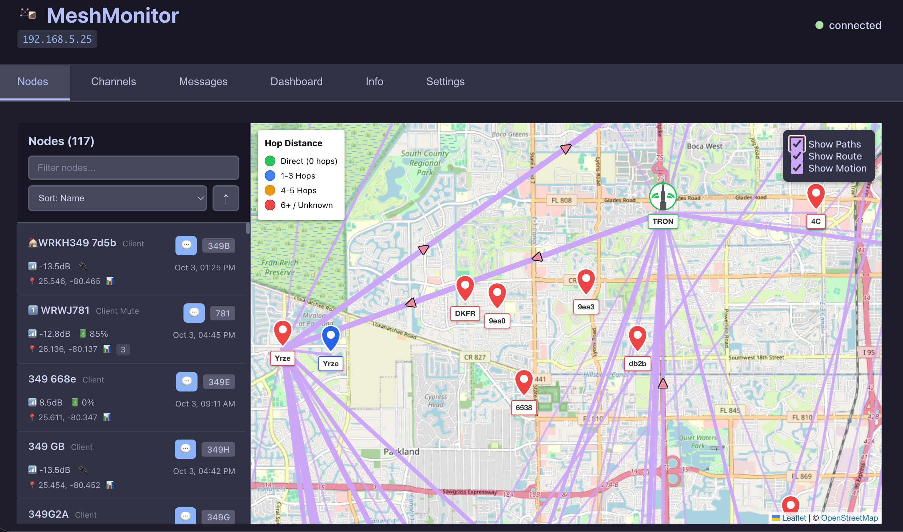
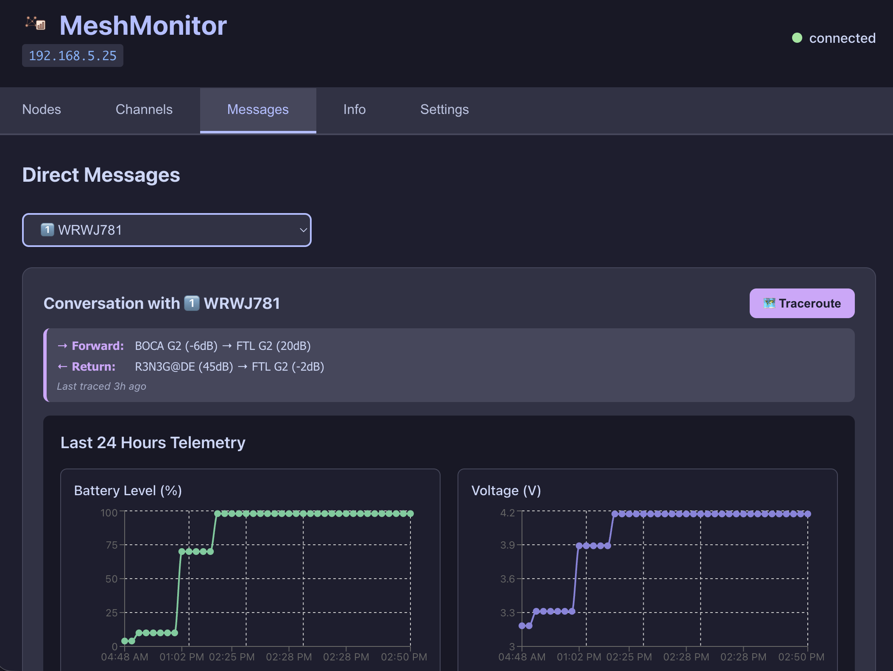

# MeshMonitor

[](https://github.com/Yeraze/meshmonitor/actions/workflows/ci.yml)
[](https://github.com/Yeraze/meshmonitor/actions/workflows/pr-tests.yml)
[](https://github.com/Yeraze/meshmonitor/pkgs/container/meshmonitor)
[](https://github.com/Yeraze/meshmonitor/pkgs/container/meshmonitor)
[](https://github.com/Yeraze/meshmonitor/blob/main/LICENSE)

A comprehensive web application for monitoring Meshtastic mesh networks over IP. Built with React, TypeScript, and Node.js, featuring a beautiful Catppuccin Mocha dark theme and persistent SQLite database storage.





## Features

### 🌐 **Real-time Mesh Network Monitoring**
- Connect to Meshtastic nodes via HTTP/HTTPS
- Real-time node discovery and status updates
- Signal strength monitoring (SNR, RSSI)
- GPS position tracking
- Battery and voltage telemetry
- Node role display (Client, Router, Repeater, etc.)
- Hops Away tracking for network distance

### 💬 **iPhone Messages-Style UI**
- Beautiful message bubbles with proper alignment
- Sender identification dots with tooltips
- Real-time message delivery status
- Send and receive text messages
- Direct messaging and channel broadcasts
- Message persistence across restarts
- Optimistic UI updates for instant feedback

### 🗄️ **Persistent Data Storage**
- SQLite database for messages, nodes, and traceroutes
- Automatic data deduplication
- Export/import functionality
- Data cleanup utilities
- Cross-restart persistence
- Traceroute history storage with SNR data

### 🎨 **Modern UI/UX**
- Catppuccin Mocha dark theme
- Responsive design for mobile/desktop
- Real-time connection status
- Interactive node cards
- Smooth animations and transitions

### 🗺️ **Network Mapping & Traceroutes**
- Interactive map with node positions
- Automatic traceroute scheduler (runs every 3 minutes)
- Weighted route visualization (thickness based on usage)
- Route display with "Show Routes" toggle
- Network topology discovery
- Traceroute history with SNR tracking

### 🐳 **Docker Support**
- Pre-built images on GitHub Container Registry
- Full containerization with Docker and Docker Compose
- Persistent data volumes
- Production-ready deployment
- Environment-based configuration
- Multi-architecture support

## Quick Start

### Prerequisites

- Node.js 20+ or 22+ (Node.js 18 is deprecated and will lose support April 2025)
- Docker (recommended) or local Node.js environment
- A Meshtastic device with WiFi/Ethernet connectivity
- Network access to your Meshtastic node

### Docker Deployment

#### Option 1: Using Pre-built Image from GitHub Container Registry (Recommended)

The easiest way to deploy MeshMonitor is using the pre-built Docker images published to GitHub Container Registry:

```bash
# Set environment variables
export MESHTASTIC_NODE_IP=192.168.1.100
export MESHTASTIC_USE_TLS=false

# Pull and start the application
docker-compose up -d
```

The default `docker-compose.yml` is configured to use `ghcr.io/yeraze/meshmonitor:latest`.

You can also specify a specific version:
```bash
docker pull ghcr.io/yeraze/meshmonitor:1.0.0
docker run -d \
  -p 8080:3001 \
  -v meshmonitor-data:/data \
  -e MESHTASTIC_NODE_IP=192.168.1.100 \
  ghcr.io/yeraze/meshmonitor:1.0.0
```

#### Option 2: Build Locally

If you want to build from source:

1. **Edit docker-compose.yml** - Comment out the `image` line and uncomment the `build` section:
   ```yaml
   # image: ghcr.io/yeraze/meshmonitor:latest
   build:
     context: .
     dockerfile: Dockerfile
   ```

2. **Build and start**:
   ```bash
   docker-compose up -d --build
   ```

#### Access the Application
- Open http://localhost:8080 in your browser
- The application will automatically attempt to connect to your Meshtastic node

#### Available Image Tags
- `latest` - Latest build from main branch
- `1.0.0`, `1.0`, `1` - Specific version tags
- `main` - Development builds from main branch

### Kubernetes Deployment

MeshMonitor includes a Helm chart for easy deployment to Kubernetes clusters. The chart supports all Docker environment variables, persistent storage, ingress, and subfolder deployments.

**Quick Install:**
```bash
helm install meshmonitor ./helm/meshmonitor \
  --set env.meshtasticNodeIp=192.168.1.100 \
  --set env.meshtasticUseTls=false
```

For complete Kubernetes documentation, configuration options, and examples, see the [Helm Chart README](helm/README.md).

### Development Setup

1. **Clone the repository**
   ```bash
   git clone <repository-url>
   cd meshmonitor
   ```

2. **Install dependencies**
   ```bash
   npm install
   ```

3. **Configure environment**
   ```bash
   cp .env.example .env
   # Edit .env with your Meshtastic node's IP address
   ```

4. **Start development servers**
   ```bash
   npm run dev:full
   ```

   This starts both the React dev server (port 5173) and the Express API server (port 3001).

## Configuration

### Environment Variables

| Variable | Default | Description |
|----------|---------|-------------|
| `MESHTASTIC_NODE_IP` | `192.168.1.100` | IP address or hostname of your Meshtastic node |
| `MESHTASTIC_PORT` | (empty) | Port number (optional, defaults to 80/443 based on TLS setting) |
| `MESHTASTIC_BASE_PATH` | (empty) | API base path for proxies (e.g., `/api/meshtastic/gateway1` for Home Assistant) |
| `MESHTASTIC_USE_TLS` | `false` | Enable HTTPS connection to node |
| `NODE_ENV` | `development` | Environment mode |
| `PORT` | `3001` | Server port (production) |
| `BASE_URL` | (empty) | Runtime base URL path for subfolder deployment (e.g., `/meshmonitor`) |

### Meshtastic Node Requirements

Your Meshtastic device must have:
- WiFi or Ethernet connectivity
- HTTP API enabled
- Network accessibility from MeshMonitor

### Home Assistant Proxy Support

MeshMonitor can connect to Meshtastic nodes through the [Home Assistant Meshtastic Integration](https://github.com/meshtastic/home-assistant) proxy. This is useful for:
- Connecting to serial or Bluetooth Meshtastic devices
- Sharing access to a node with multiple applications
- Integrating with existing Home Assistant infrastructure

**Example Configuration:**
```bash
MESHTASTIC_NODE_IP=homeassistant.local
MESHTASTIC_PORT=8123
MESHTASTIC_BASE_PATH=/api/meshtastic/gateway1
MESHTASTIC_USE_TLS=false
```

Or with Docker:
```yaml
environment:
  - MESHTASTIC_NODE_IP=homeassistant.local
  - MESHTASTIC_PORT=8123
  - MESHTASTIC_BASE_PATH=/api/meshtastic/gateway1
```

**Note:** The exact base path will depend on your Home Assistant configuration. Check your Home Assistant integration settings for the correct API endpoint path.

## Authentication

**MeshMonitor does not include internal authentication.** The application assumes it is running in a trusted environment or behind an authentication layer.

If you need to secure access to MeshMonitor, you should proxy it behind an authentication provider such as:

- **[Authentik](https://goauthentik.io/)** - Open-source Identity Provider
- **[Pocketbase](https://pocketbase.io/)** - Lightweight auth backend
- **[Authelia](https://www.authelia.com/)** - Authentication and authorization server
- **nginx with basic auth** - Simple username/password protection

### Example: nginx with Basic Auth

```nginx
location / {
    auth_basic "MeshMonitor";
    auth_basic_user_file /etc/nginx/.htpasswd;
    proxy_pass http://localhost:8080;
    proxy_set_header Host $host;
    proxy_set_header X-Real-IP $remote_addr;
}
```

### Example: Docker Compose with Authentik

Refer to [Authentik's documentation](https://docs.goauthentik.io/) for setting up a reverse proxy with authentication.

## Reverse Proxy Configuration

MeshMonitor supports being served from a subfolder using the `BASE_URL` environment variable. This allows you to host MeshMonitor at a path like `https://example.com/meshmonitor/` instead of the root.

**Important:** BASE_URL is now a **runtime-only** configuration. You can use the same Docker image for any base path - just set the BASE_URL environment variable when running the container.

### nginx Subfolder Example

```nginx
location ^~ /meshmonitor {
    # Strip the /meshmonitor prefix when proxying
    rewrite /meshmonitor(.*) /$1 break;

    proxy_pass http://localhost:8080;
    proxy_set_header Host $host;
    proxy_set_header X-Real-IP $remote_addr;
    proxy_set_header X-Forwarded-For $proxy_add_x_forwarded_for;
    proxy_set_header X-Forwarded-Proto $scheme;
}
```

### Docker Configuration

Simply set the `BASE_URL` environment variable at runtime:

```yaml
services:
  meshmonitor:
    image: ghcr.io/yeraze/meshmonitor:latest
    environment:
      - BASE_URL=/meshmonitor  # Set at runtime, no rebuild needed!
      - MESHTASTIC_NODE_IP=192.168.1.100
    # ... rest of configuration
```

Or with docker run:

```bash
docker run -d \
  -p 8080:3001 \
  -e BASE_URL=/meshmonitor \
  -e MESHTASTIC_NODE_IP=192.168.1.100 \
  ghcr.io/yeraze/meshmonitor:latest
```

The HTML is dynamically rewritten at runtime to include the correct base path for all assets and API calls. This means:
- ✅ No need to rebuild the image for different base paths
- ✅ The same image works for root (`/`) or any subfolder path
- ✅ Can be changed by simply restarting the container with a different BASE_URL

## Architecture

```
┌─────────────────┐    ┌─────────────────┐    ┌─────────────────┐
│   React App     │────│   Express API   │────│  SQLite Database│
│  (Frontend)     │    │   (Backend)     │    │   (Persistence) │
└─────────────────┘    └─────────────────┘    └─────────────────┘
         │                        │                        │
         │                        │                        │
         └────────────────────────┼────────────────────────┘
                                  │
                     ┌─────────────────┐
                     │ Meshtastic Node │
                     │   (HTTP API)    │
                     └─────────────────┘
```

### Key Components

- **Frontend (React)**: User interface with Catppuccin theme
- **Backend (Express)**: REST API and static file serving
- **Database (SQLite)**: Message and node data persistence
- **Meshtastic Integration**: HTTP API client for mesh communication

## API Endpoints

### Nodes
- `GET /api/nodes` - Get all nodes
- `GET /api/nodes/active` - Get recently active nodes

### Messages
- `GET /api/messages` - Get messages with pagination
- `POST /api/messages/send` - Send message to channel
- `GET /api/messages/channel/:channel` - Channel-specific messages
- `GET /api/messages/direct/:nodeId1/:nodeId2` - Direct messages

### Statistics
- `GET /api/stats` - Database statistics
- `GET /api/health` - Health check

### Traceroutes
- `GET /api/traceroutes/recent` - Get recent traceroutes
- `POST /api/traceroutes/send` - Send traceroute request

### Data Management
- `POST /api/export` - Export all data
- `POST /api/import` - Import data
- `POST /api/cleanup/messages` - Cleanup old messages
- `POST /api/cleanup/nodes` - Cleanup inactive nodes
- `POST /api/cleanup/channels` - Cleanup invalid channels

### Channels
- `GET /api/channels` - Get all channels
- `GET /api/config` - Get configuration
- `GET /api/device-config` - Get device configuration

### Connection
- `GET /api/connection` - Get connection status

## Data Structures

### Node Information
```typescript
interface DeviceInfo {
  nodeNum: number;
  user?: {
    id: string;
    longName: string;
    shortName: string;
    hwModel: number;
  };
  position?: {
    latitude: number;
    longitude: number;
    altitude?: number;
  };
  deviceMetrics?: {
    batteryLevel?: number;
    voltage?: number;
    snr?: number;
    rssi?: number;
  };
  lastHeard?: number;
}
```

### Message Format
```typescript
interface MeshMessage {
  id: string;
  from: string;
  to: string;
  text: string;
  timestamp: Date;
  channel: number;
  portnum?: number;
  acknowledged?: boolean;
  isLocalMessage?: boolean;
}
```

### Channel Information
```typescript
interface Channel {
  id: number;
  name: string;
  psk?: string;
  uplinkEnabled: boolean;
  downlinkEnabled: boolean;
  createdAt: number;
  updatedAt: number;
}
```

## Development

### Available Scripts

#### Development
- `npm run dev` - Start React development server
- `npm run dev:server` - Start Express API server
- `npm run dev:full` - Start both development servers
- `npm run build` - Build React app for production
- `npm run build:server` - Build Express server for production
- `npm start` - Start production server

#### Testing & Quality
- `npm run test` - Run tests in watch mode
- `npm run test:run` - Run all tests once
- `npm run test:ui` - Run tests with interactive UI
- `npm run test:coverage` - Generate coverage report
- `npm run lint` - Run ESLint
- `npm run typecheck` - Run TypeScript compiler checks

### Testing

MeshMonitor includes a comprehensive test suite using Vitest and Testing Library:

- **Unit Tests**: Database operations, API endpoints, and utility functions
- **Component Tests**: React components with user interaction testing
- **Integration Tests**: API integration and data flow validation
- **100% passing tests** maintained through CI/CD

All pull requests must pass automated testing before merge. See [CONTRIBUTING.md](CONTRIBUTING.md) for testing guidelines.

### CI/CD Pipeline

Our GitHub Actions workflows ensure code quality:

- **PR Tests**: Quick validation on every pull request
- **Full CI**: Comprehensive testing across Node.js versions
- **Docker Builds**: Multi-platform image creation
- **Security Scanning**: Vulnerability detection with Trivy
- **Release Automation**: Automated versioning and publishing

### Project Structure

```
meshmonitor/
├── src/
│   ├── components/          # React components
│   ├── services/           # Services (Meshtastic, Database)
│   ├── server/             # Express server
│   └── App.tsx             # Main React application
├── docs/                   # Documentation
├── data/                   # SQLite database (development)
├── docker-compose.yml      # Docker Compose configuration
├── Dockerfile             # Docker build configuration
└── package.json           # Dependencies and scripts
```

### Technology Stack

**Frontend:**
- React 18 with TypeScript
- Vite (build tool)
- CSS3 with Catppuccin theme
- Modern ES modules

**Backend:**
- Node.js with Express
- TypeScript
- better-sqlite3 (SQLite driver)
- CORS enabled

**DevOps:**
- Docker with multi-stage builds
- Docker Compose for orchestration
- Volume mounting for data persistence
- Environment-based configuration

## Troubleshooting

### Common Issues

1. **Cannot connect to Meshtastic node**
   - Check IP address in `.env` file
   - Ensure node has HTTP API enabled
   - Verify network connectivity
   - Check firewall settings

2. **Database errors**
   - Ensure `/data` directory is writable
   - Check disk space
   - Verify SQLite permissions

3. **Build failures**
   - Run `npm install` to update dependencies
   - Check Node.js version (20+ required)
   - Clear `node_modules` and reinstall

### Logs

View logs in development:
```bash
npm run dev:full
```

View Docker logs:
```bash
docker-compose logs -f meshmonitor
```

## Contributing

We welcome contributions! Please see our [Contributing Guide](CONTRIBUTING.md) for details on:

- Development setup
- Testing requirements
- Code style guidelines
- Pull request process
- CI/CD workflows

Quick start:
1. Fork the repository
2. Create a feature branch (`git checkout -b feature/amazing-feature`)
3. Make your changes and add tests
4. Run tests locally (`npm run test:run`)
5. Commit with conventional commits (`feat: add amazing feature`)
6. Push and create a Pull Request

## License

This project is licensed under the MIT License - see the [LICENSE](LICENSE) file for details.

## Acknowledgments

- [Meshtastic](https://meshtastic.org/) - Open source mesh networking
- [Catppuccin](https://catppuccin.com/) - Soothing pastel theme
- [React](https://reactjs.org/) - Frontend framework
- [better-sqlite3](https://github.com/WiseLibs/better-sqlite3) - SQLite driver

---

**MeshMonitor** - Monitor your mesh, beautifully. 🌐✨

_This application was entirely vibe coded with [Claude Code](https://claude.ai/code)._