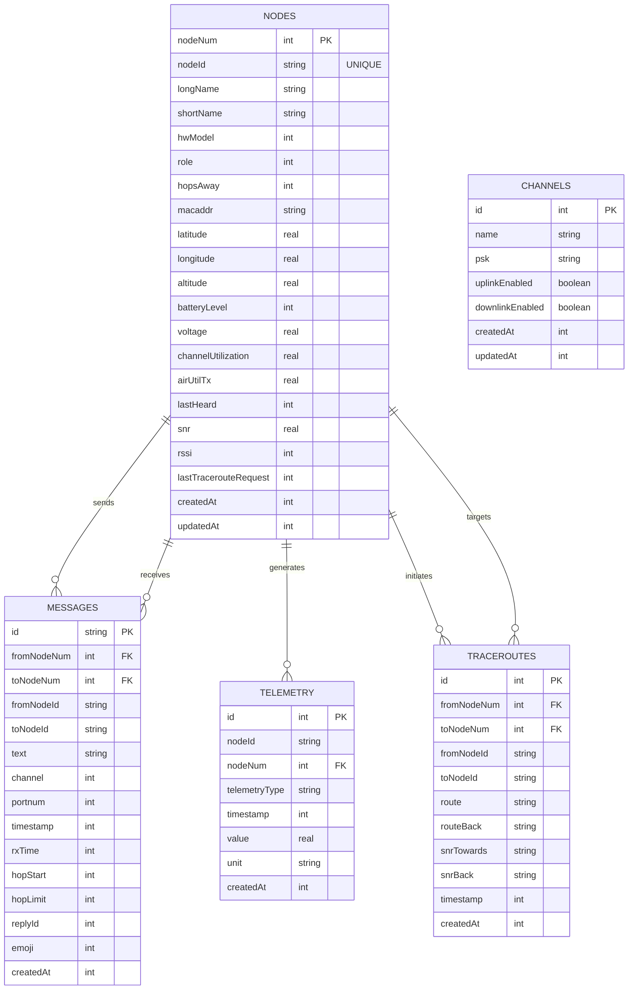

# MeshMonitor System Architecture

## Overview

MeshMonitor is a full-stack web application designed to monitor Meshtastic mesh networks over IP. The system follows a modern three-tier architecture with a React frontend, Node.js/Express backend, and SQLite database.

## High-Level Architecture

```
┌─────────────────────────────────────────────────────────────────┐
│                        MeshMonitor System                       │
├─────────────────────────────────────────────────────────────────┤
│  ┌─────────────────┐    ┌─────────────────┐    ┌─────────────┐  │
│  │   React App     │────│   Express API   │────│  SQLite DB  │  │
│  │  (Frontend)     │    │   (Backend)     │    │(Persistence)│  │
│  └─────────────────┘    └─────────────────┘    └─────────────┘  │
│           │                        │                     │      │
│           │                        │                     │      │
│           └────────────────────────┼─────────────────────┘      │
│                                    │                            │
│                                    │ TCP Connection             │
│                                    │ (Event-Driven)             │
│                                    ↓                            │
│                       ┌─────────────────┐                      │
│                       │ Meshtastic Node │                      │
│                       │ (TCP Port 4403) │                      │
│                       └─────────────────┘                      │
└─────────────────────────────────────────────────────────────────┘
```

## Component Architecture

### 1. Frontend Layer (React Application)

**Technology Stack:**
- React 19 with TypeScript
- Vite for build tooling
- CSS3 with Catppuccin Mocha theme
- Modern ES modules

**Key Components:**
```
src/
├── App.tsx                 # Main application component
├── App.css                 # Catppuccin theme styles
├── components/
│   ├── TelemetryGraphs.tsx # Telemetry visualization component
│   └── TelemetryGraphs.css # Telemetry graph styles
├── main.tsx               # Application entry point
└── services/
    └── database.ts        # Database service (shared)
```

**Responsibilities:**
- User interface rendering and interaction
- Real-time connection status display
- Message composition and display
- Node information visualization with map integration
- Telemetry data visualization with graphs
- Traceroute visualization and management
- Channel management interface
- Client-side state management

**Data Flow:**
1. User interactions trigger API calls to Express backend
2. Backend maintains persistent TCP connection to Meshtastic node (port 4403)
3. Node streams protobuf messages as framed TCP packets (event-driven)
4. Database persists all node, message, and telemetry data
5. Frontend polls backend REST API for updates every 2 seconds
6. Local state updates trigger UI re-renders
7. Map and telemetry graphs update in real-time

### 2. Backend Layer (Express API Server)

**Technology Stack:**
- Node.js with Express framework
- TypeScript for type safety
- CORS for cross-origin requests
- Compression and security middleware

**Key Components:**
```
src/server/
├── server.ts                     # Express server with API routes
├── meshtasticManager.ts          # Meshtastic connection manager (TCP-based)
├── tcpTransport.ts               # TCP transport layer with frame parsing
├── meshtasticProtobufService.ts # Protobuf message handling
├── protobufService.ts           # Core protobuf serialization
└── protobufLoader.ts            # Protobuf schema loader
```

**API Design:**
- RESTful endpoints following OpenAPI standards
- JSON request/response format
- Event-driven TCP connection to Meshtastic node (port 4403)
- Binary frame protocol with 4-byte headers (0x94 0xc3 + length)
- Protobuf message encoding/decoding for Meshtastic protocol
- Automatic reconnection with exponential backoff
- Error handling and validation
- Static file serving for production

**Responsibilities:**
- Serve React application static files
- Provide REST API for database operations
- Handle data export/import operations
- Manage database connections and transactions

### 3. Data Layer (SQLite Database)

**Technology Stack:**
- SQLite with better-sqlite3 driver
- WAL mode for better concurrency
- Foreign key constraints enabled
- Comprehensive indexing strategy

**Database Service:**
```
src/services/
└── database.ts            # Database service and schema
```

**Schema includes:**
- **nodes**: Device information and telemetry
- **messages**: Text messages and communications
- **channels**: Channel configuration
- **telemetry**: Time-series telemetry data
- **traceroutes**: Network path analysis

**Responsibilities:**
- Persistent storage of messages and node information
- Data deduplication and integrity
- Query optimization and performance
- Backup and restore functionality

## Data Architecture

### Core Data Entities



### Data Flow Patterns

**1. Message Processing Pipeline:**
```
Meshtastic Node → TCP Frame → TCP Transport → MeshtasticManager → Database → Frontend
```

**2. Node Discovery Flow:**
```
TCP Event → FromRadio Packet → Protobuf Decode → Node Info Processing → Database Update → UI Refresh
```

**3. User Message Sending:**
```
UI Input → REST API → MeshtasticManager → ToRadio Packet → TCP Frame → Meshtastic Network
```

**4. Connection Lifecycle:**
```
1. TCP Connect (port 4403) → Send want_config_id
2. Node streams config → Parse frames → Extract protobuf
3. Event-driven message processing
4. Automatic reconnection on disconnect (exponential backoff)
```

## Integration Architecture

### Meshtastic TCP Streaming Integration (v1.10.0+)

**TCP Frame Protocol:**

MeshMonitor uses Meshtastic's native TCP streaming protocol for efficient, real-time communication:

```
Frame Structure:
┌──────┬──────┬───────────┬───────────┬─────────────────┐
│ 0x94 │ 0xc3 │ LEN_MSB   │ LEN_LSB   │ PROTOBUF_DATA   │
└──────┴──────┴───────────┴───────────┴─────────────────┘
  1B     1B       1B          1B         0-512 bytes

- Magic bytes: 0x94 0xc3 (Meshtastic protocol identifier)
- Length: 16-bit big-endian (max 512 bytes)
- Payload: FromRadio/ToRadio protobuf message
```

**Connection Sequence:**
```typescript
// Event-driven connection flow
1. TCP socket connects to node:4403
2. Backend sends want_config_id (ToRadio protobuf)
3. Node streams configuration frames:
   - myNodeInfo (node identity)
   - channels (channel configuration)
   - nodeInfos (node database)
4. Event handlers process incoming frames
5. Continuous real-time message delivery
```

**Frame Processing Pipeline:**
```
TCP Stream → Buffer Accumulator → Frame Detector (0x94 0xc3)
→ Length Validator (≤512 bytes) → Protobuf Decoder → Message Handler
```

**Packet Processing:**
- **NodeInfo packets**: Device information, user details, and role configuration
- **Position packets**: GPS coordinates, altitude, and location timestamps
- **Telemetry packets**: Battery level, voltage, channel utilization, air utilization
- **Text Message packets**: User communications with replyId and emoji support
- **Traceroute packets**: Network path analysis and SNR measurements
- **Admin packets**: Channel configuration and node management

**Error Handling:**
- Automatic reconnection with exponential backoff (1s → 2s → 4s → 8s → 16s → 30s max)
- Maximum 10 reconnection attempts before failure
- Frame corruption detection and recovery (skip invalid frames, resync to next 0x94 0xc3)
- Connection health monitoring via socket events
- Graceful degradation on network failures

**Benefits vs HTTP Polling:**
- **~90% bandwidth reduction** - No repeated HTTP overhead
- **Instant message delivery** - Event-driven, not polling-based
- **Lower latency** - TCP push model vs 2-second poll interval
- **More efficient** - Single persistent connection vs repeated HTTP requests

### Integration Options

MeshMonitor's TCP architecture supports multiple connection scenarios:

**1. Direct TCP Connection (WiFi/Ethernet Nodes)**
```
MeshMonitor → TCP:4403 → Meshtastic Node
```
Standard deployment for nodes with network connectivity.

**2. meshtasticd Proxy (BLE/Serial Nodes)**
```
MeshMonitor → TCP:4403 → meshtasticd → BLE/Serial → Meshtastic Node
```
[meshtasticd](https://github.com/meshtastic/python) provides TCP proxy for Bluetooth and Serial devices, enabling MeshMonitor to connect to any Meshtastic hardware.

**3. HomeAssistant Integration**
```
MeshMonitor → TCP:4403 → HomeAssistant Meshtastic Integration → Node
```
Connect through HomeAssistant's native Meshtastic support.

**4. Custom TCP Proxies**
```
MeshMonitor → TCP:4403 → Custom Proxy → Meshtastic Network
```
Any proxy implementing the Meshtastic TCP protocol can bridge to MeshMonitor.

### Real-time Updates

**Backend TCP Connection:**
- Persistent TCP socket with event-driven message delivery
- Automatic frame parsing and protobuf decoding
- No polling of the Meshtastic node (event-driven push model)
- Immediate database updates on message receipt

**Frontend API Polling:**
- Frontend polls Express REST API every 2 seconds for database updates
- Efficient query patterns with indexes
- Optimistic UI updates for message sending
- Automatic connection status monitoring

**State Synchronization:**
- TCP events immediately update backend in-memory cache
- Database persistence for all messages, nodes, and telemetry
- Frontend polling fetches latest database state
- Optimistic UI updates with rollback capability

## Security Architecture

### Network Security
- TCP socket security with keep-alive and timeout protection
- CORS configuration for cross-origin protection on REST API
- Request rate limiting and validation for API endpoints
- Socket connection validation and sanitization

### Data Security
- SQL injection prevention with prepared statements
- Input sanitization and validation
- No sensitive credential storage

### Container Security
- Non-root user execution in Docker
- Minimal container surface area
- Read-only filesystem where possible

## Scalability Considerations

### Current Design
- Single SQLite database instance with WAL mode for concurrency
- In-memory caching for active session data
- Single Meshtastic node connection via TCP streaming (port 4403)
- Event-driven message processing with immediate database updates
- Telemetry data retention with configurable cleanup
- Traceroute automation for network topology mapping
- Persistent TCP connection with automatic reconnection

### Future Scaling Options
- Database connection pooling for higher concurrency
- Redis for distributed caching across instances
- Multiple node support with load balancing
- WebSocket connections to frontend for real-time UI updates (eliminate polling)
- Time-series database for telemetry data (InfluxDB, TimescaleDB)
- GraphQL API for flexible data queries
- Horizontal scaling with multiple MeshMonitor instances

## Performance Architecture

### Database Optimization
- Comprehensive indexing on query columns
- WAL mode for concurrent reads/writes
- Periodic VACUUM operations
- Query result pagination

### Frontend Performance
- React component memoization
- Efficient re-rendering with keys
- Lazy loading for large datasets
- CSS-based animations (GPU accelerated)

### Backend Performance
- Express.js with compression middleware
- Efficient SQL query patterns
- Response caching headers
- Optimized Docker builds

## Deployment Architecture

### Development Environment
```
┌─────────────────┐    ┌─────────────────┐    ┌─────────────────┐
│  Vite Dev       │    │  Express Dev    │    │  Meshtastic     │
│  Server         │    │  Server         │────│  Node           │
│  (Port 5173)    │    │  (Port 3001)    │TCP │  (Port 4403)    │
└─────────────────┘    └─────────────────┘    └─────────────────┘
```

### Production Environment
```
┌─────────────────────────────────────┐
│           Docker Container           │
├─────────────────────────────────────┤
│  ┌─────────────────────────────────┐ │
│  │        Express Server           │ │
│  │    (Static Files + API)         │ │
│  │         (Port 3001)             │ │
│  └─────────────────────────────────┘ │
│  ┌─────────────────────────────────┐ │
│  │        SQLite Database          │ │
│  │       (/data volume)            │ │
│  └─────────────────────────────────┘ │
└─────────────────────────────────────┘
```

### Docker Architecture
- **Multi-stage builds**: Separate build and runtime environments
- **Volume mounting**: Persistent data storage
- **Environment configuration**: Runtime parameter injection
- **Health checks**: Container monitoring and recovery

## Monitoring and Observability

### Logging Strategy
- Structured logging with timestamps
- Different log levels (debug, info, warn, error)
- Request/response logging for API endpoints
- Database operation logging

### Health Monitoring
- `/api/health` endpoint for system status
- Database connection monitoring
- Meshtastic node connectivity checks
- Container resource utilization

### Error Tracking
- Graceful error handling at all layers
- User-friendly error messages
- Detailed error logging for debugging
- Automatic error recovery where possible

## Feature Architecture

### Telemetry System
The application tracks and visualizes various telemetry metrics:
- **Battery Monitoring**: Tracks battery level and voltage over time
- **Channel Utilization**: Monitors radio channel usage
- **Air Utilization**: Tracks transmit air time utilization
- **SNR/RSSI Tracking**: Signal quality metrics for network analysis
- **Time-series Storage**: Efficient storage with periodic cleanup

### Traceroute System
Automated network topology discovery:
- **Automatic Traceroute**: Periodically discovers network paths
- **Bidirectional Analysis**: Tracks routes in both directions
- **SNR Mapping**: Records signal quality along each hop
- **Route Visualization**: Display network paths on the map
- **Historical Tracking**: Maintains route history for analysis

### Channel Management
Multi-channel support for Meshtastic networks:
- **Primary Channel**: Default channel 0 for main communications
- **Named Channels**: Support for admin, secondary, and custom channels
- **Channel Configuration**: PSK and uplink/downlink settings
- **Message Routing**: Automatic routing to appropriate channels

## Development Workflow

### Build Process
1. **TypeScript Compilation**: Source code type checking for both frontend and backend
2. **React Build**: Production bundle creation with Vite, including code splitting
3. **Server Build**: Express application compilation with protobuf support
4. **Docker Build**: Multi-stage container image creation
5. **Database Migration**: Automatic schema updates on startup

### Deployment Process
1. **Environment Preparation**: Configuration setup
2. **Database Migration**: Schema updates if needed
3. **Application Deployment**: Container startup
4. **Health Verification**: System status checks
5. **Monitoring Setup**: Log and metric collection

This architecture provides a solid foundation for monitoring Meshtastic mesh networks with room for future enhancements and scaling.